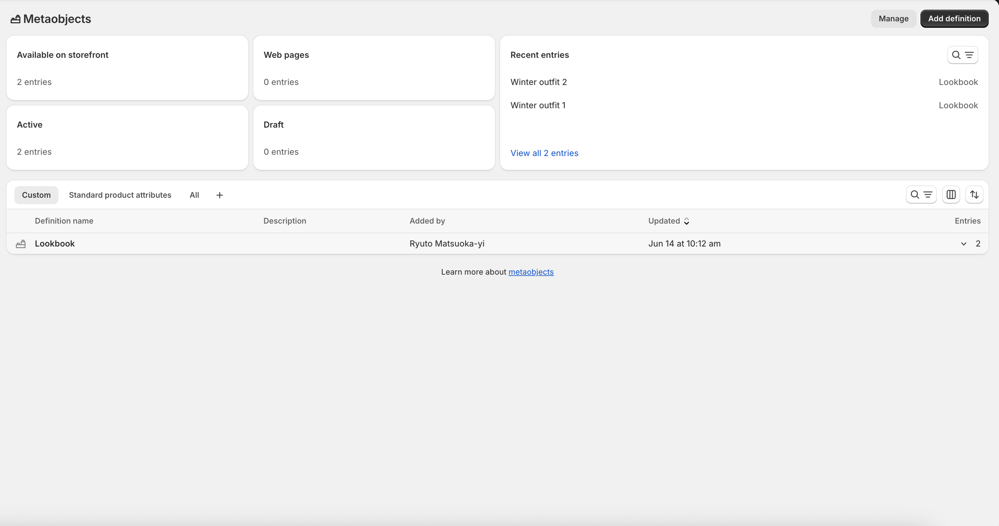
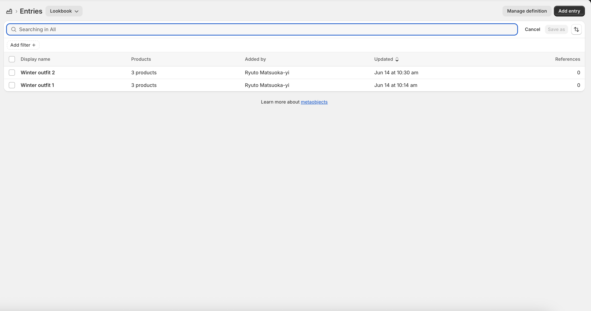
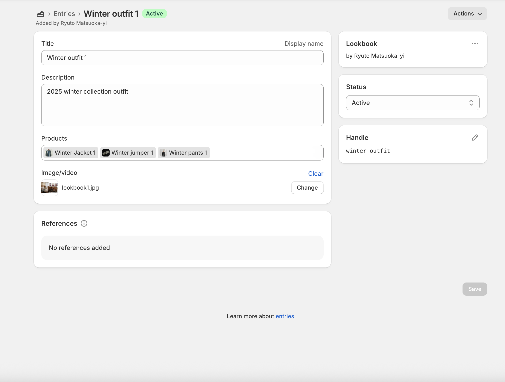
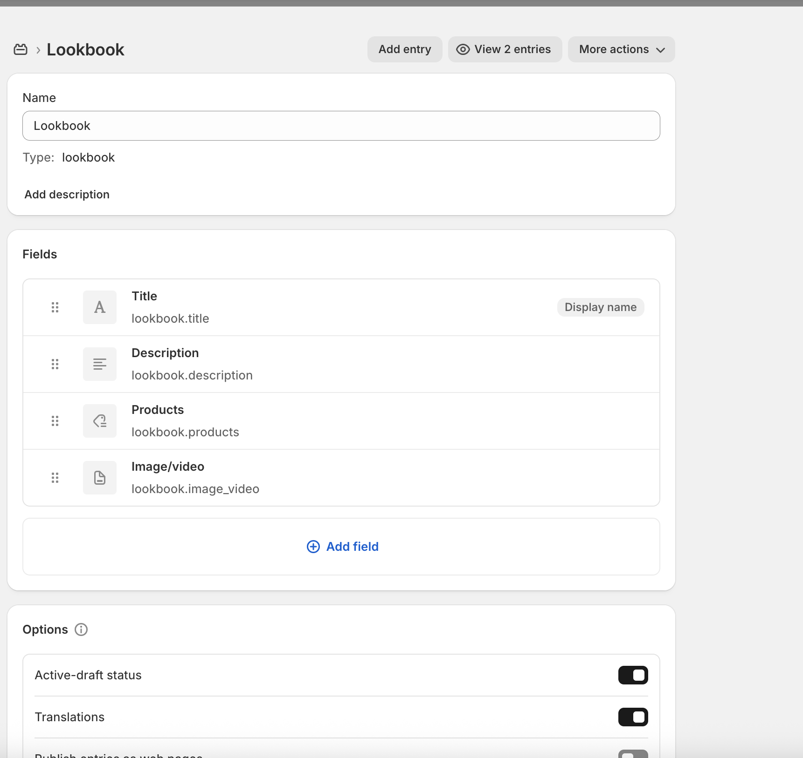

# Shopify Lookbook Feature Development Task

This project implements a **Lookbook feature** using **Shopify metaobjects and theme sections**, following the provided technical brief.

## Overview

Two separate theme sections were developed to satisfy different use cases:
1. **Lookbook Manual Section** – For all page types (e.g. home, collections, custom pages) where the merchant can manually select a specific Lookbook to display.
2. **Lookbook Dynamic Section** – Designed specifically for product pages. It automatically renders a Lookbook if the current product is included in any published Lookbook metaobject.

This separation improves clarity for the content manager by:
- Avoiding confusion over which Lookbook to select on product pages.
- Providing layout flexibility on other templates.

## Why Two Sections?

While it was technically possible to replicate the same outcome using dynamic settings and reuse existing components (like the Hero or Split sections), the task explicitly required building the feature from scratch. 

## How It Works

On **main pages**, merchants can add the **Main Lookbook section** and choose any published Lookbook from a dropdown.
On **product pages**, the **Product Page Lookbook section** checks if the current product is part of any Lookbook and displays them automatically — no input required from the merchant.

## Metaobject Configuration

Lookbooks are configured via the **Shopify Admin** under:
> **Settings > Custom Data > Metaobjects > Lookbook**.

Each Lookbook metaobject includes the following fields:
- **Title**
- **Description**
- **Image or Video**
- **List of Products**

## Screenshots of Metaobject configuration:

### Metaobjects Dashboard

### Lookbook entries

### Lookbook entry

### Lookbook metaobject definition

